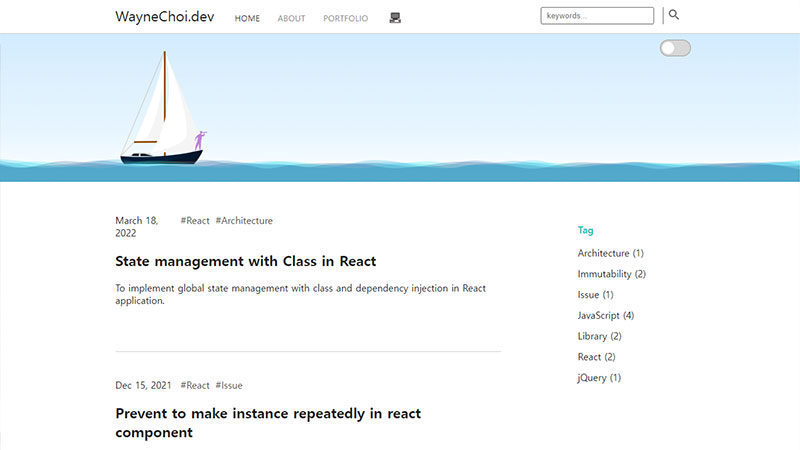
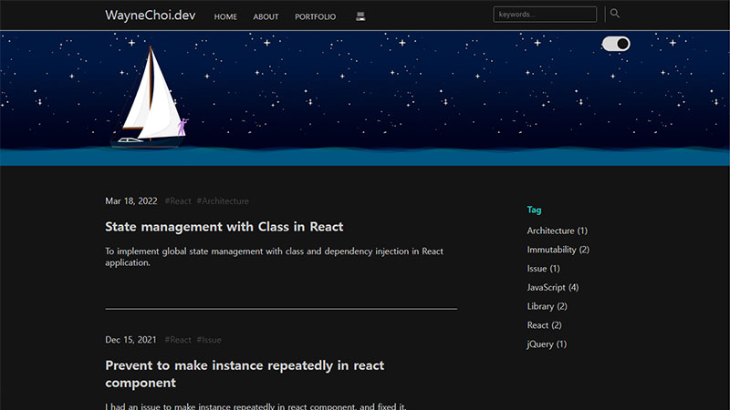
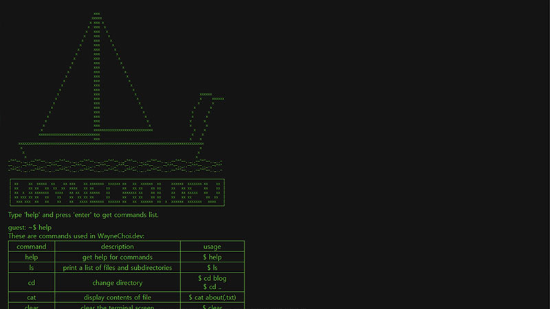

~~ # WayneChoi.Dev ~~
It is deprecated.

## Overview

It is a static blog site generated with Next.js. Posts are written by markdown, and parsed to JSX.

[https://radicaldilettante.github.io/expired-waynechi.dev/](https://radicaldilettante.github.io/expired-waynechi.dev/)

## Features

- Parsing Markdown files to JSX

- Canvas Animation

- Dark Theme

    

- Command line rendering for blog contents

    

### To be implemented in the future

- Re-implement dark theme without direct manipulating DOM. (I got some styling issue for few devices.)
- Apply dark theme in portfolio page as well
